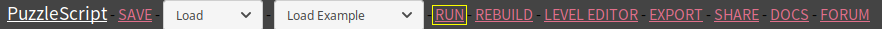
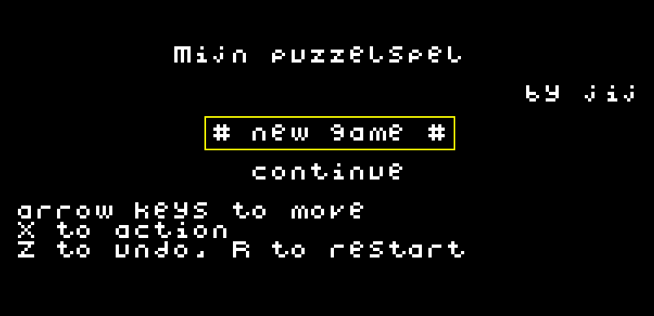
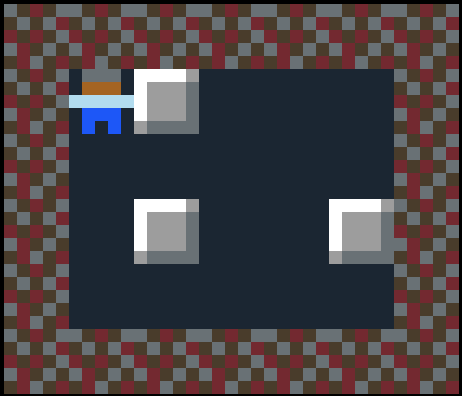

**Inhoud**

- [Inleiding](index.md)
- [1 - Aan de slag met PuzzleScript](1-aan-de-slag-met-puzzlescript.md)
- [2 - Maak je eigen regels](2-maak-je-eigen-regels.md)
- [3 - Kleuren en plaatjes](3-kleuren-en-plaatjes.md)
- [4 - Sla je werk op](4-sla-je-werk-op.md)
- [5 - Nieuwe voorwerpen en winnen](5-nieuwe-voorwerpen-en-winnen.md)
- [6 - Geluid en muziek](6-geluid.md)
- [7 - Een woord vormen](7-een-woord-vormen.md)
- [8 - Waarmee wil je verder?](8-waarmee-verder.md)

# 1 - Aan de slag met PuzzleScript

## Bekijk het voorbeeldspel

Open het <a href='https://www.puzzlescript.net/editor.html?hack=e72bf94dcf4bad6eeb92ffa10ba5ea83' target='_blank'>voorbeeldproject</a>. Dit is een simpel spelletje waarbij je kistjes kunt schuiven en moet proberen er drie op een rij te krijgen.

Aan de linkerkant zie je de code van het project. Het lijkt misschien ingewikkeld, maar we zullen het stap voor stap bekijken.

Rechtsboven kun je het spel testen. Klik bovenin op RUN om te (her)starten en druk op de X-toets om het spel te starten.



Je bestuurt een figuurtje met de pijltjestoetsen. Als je tegen een kistje aanloopt, duw je het een vakje verder. Je kunt maar 1 kistje tegelijk duwen.

Probeer maar om drie kistjes op een rij te krijgen (naast elkaar of boven elkaar). Als dit lukt, verdwijnen ze. Als alle kistjes verdwenen zijn, ga je naar het volgende level.

TIP: als je op Z drukt, maak je je laatste stap ongedaan. Zo kun je snel foutjes herstellen. Je kunt ook overnieuw beginnen door R te drukken.

## Maak zelf een level

Er zijn nu maar 2 levels. Laten we een level toevoegen.

De levels staan in het `LEVELS` gedeelte van het programma, helemaal onderaan. Voeg bijvoorbeeld deze tekst toe net onder de kop `LEVELS`, zodat het er zo uitziet:

```
=======
LEVELS
=======

#######
#S@...#
#.....#
#.@..@#
#.....#
#######
```

Klik nu op "RUN" bovenaan de pagina om je code te controleren en het spel opnieuw te starten.

Selecteer in het gedeelte rechtsboven de optie "new game" (met pijltje omhoog) en druk op X. Nu speel je het level wat je net hebt toegevoegd.



Zie je hoe de tekens overeenkomen met de muren, kistjes en de speler? En waar staat de punt (.) voor?



Kun je het level oplossen?
<details><summary>KLIK HIER VOOR EEN HINT</summary>Schuif het bovenste kistje helemaal naar rechts. Schuif dan het kistje linksonder 1 vakje naar boven en dan helemaal naar rechts.</details>

### Tips
- Wil je terug naar het titelscherm terwijl je een level aan het spelen bent, bijvoorbeeld om overnieuw te beginnen? Druk op Esc.
- Als je iets hebt aangepast in het programma, kun je in plaats van "RUN" ook op "REBUILD" klikken. Het spel wordt dan niet helemaal opnieuw opgestart, maar bijgewerkt terwijl je in hetzelfde level blijft.
- Klik regelmatig op SAVE (links bovenaan; Ctrl+S drukken werkt ook) om je programma op te slaan. Dat is wel zo veilig.
- Misschien heb je de regels die beginnen met `message` ("boodschap") al gezien. Je kunt hiermee tekst tonen, bijvoorbeeld instructies.

### Wat je kunt proberen ###
- Maak het level breder door alle regels langer te maken, of hoger door meer regels toe te voegen.<br/>LET OP: elke regel voor een level moet even lang zijn, anders krijg je een foutmelding wanneer je op RUN klikt.
- Voeg muren en/of kistjes toe om level het moeilijker te maken.
- Wat gebeurt er als er twee keer een S in het level staat?

## Ben je benieuwd hoe je de regels van het spel kunt veranderen? Ga dan door naar [de volgende stap! >>](2-maak-je-eigen-regels.md)