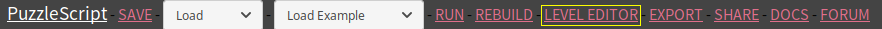
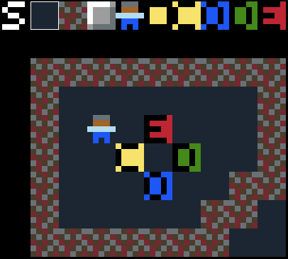

**Inhoud**

- [(terug naar het begin)](index.md)
- [8 - Waarmee wil je verder?](8-waarmee-verder.md)
- [9 - Spelers met karakter](9-spelers-met-karakter.md)

# 10 - Grotere levels en de leveleditor

Misschien wil je meer een avonturenspel maken met PuzzleScript, waar de speler door een grote wereld dwaalt, en allerlei mogelijkheden en gevaren tegenkomt.

Gelukkig zit je niet vast aan de kleine levels die we tot nu toe gemaakt hebben.

## Grotere levels

Laten we om het uit te proberen eens een level van 20 bij 20 vakjes maken, verdeeld in vier 'kamers':

```
xxxxxxxxxxmmmmmmmmmm
x........xm........m
x..m.p...xm.xx.....m
x.mm.....xm...x....m
x..m.........x.....m
x..m........x......m
x..m.....xm.xxx....m
x........xm........m
x........xm........m
xxx....xxxmmmm mmmmm
mmm....xxmxxxx.xxxxx
m........mx........x
m...x....mx.mm.....x
m..xx....mx...m....x
m.x.x....mx.mm.....x
m.xxxx...mx...m....x
m...x....mx.mm.....x
m..................x
m..................x
mmmmmmmmmmxxxxxxxxxx
```

De `x` en `m` overeenkomen met twee verschillende soorten muren. Je kunt bijvoorbeeld dit bij `OBJECTS` zetten:

```
Muur1 x
gray

Muur2 m
red
```

Vergeet niet om alle muren samen in een groep `Muur` te zetten en check of `Muur` in de groep `Object` zit (in het `LEGEND` gedeelte):

```
Muur = Muur1 or Muur2
Objects = Speler or Muur
```

Als je het spel nu draait, zie je in een keer de hele 'wereld'. Maar dat is meestal niet zo handig als je wereld zo groot wordt. Liever wil je één kamer tegelijk zien.

Om steeds een kamer van 10 bij 10 vakjes te laten zien voeg je deze regel toe bovenaan je PuzzleScript code (waar ook `title` staat):

```
flickscreen 10x10
```

Wil je liever dat het scherm 'meeschuift' met elke stap van de speler, zodat de speler altijd in het midden weergegeven wordt?  Dat kan ook. Gebruik dan in plaats van `flickscreen` het woord `zoomscreen`:

```
zoomscreen 10x10
```

Nu zie je nog steeds maar 10 bij 10 vakjes, maar het is net of er een 'camera' is die meebeweegt met de speler.

Natuurlijk hoef je niet 10x10 te gebruiken; je kunt ook meer of minder vakjes tegelijk tonen. Experimenteer er maar mee!

## Leveleditor

Zulke grote levels tekenen door steeds letters in de code te veranderen, werkt misschien niet zo handig.

Gelukkig zit er ook een leveleditor ingebouwd in PuzzleScript. Klik op LEVEL EDITOR bovenin om hem te activeren:



Je kunt je level dan bewerken:



Bovenaan staan alle voorwerpen in het spel. Klik op een voorwerp en dan in het level om dat voorwerp te plaatsen. Rechtsklik om een voorwerp weer te verwijderen.

> **Handig met het toetsenbord?** <br>
> In plaats van telkens een voorwerp te kiezen met de muis, kun je ook de nummertoetsen gebruiken: 1 selecteert het eerste voorwerp, 2 het tweede, etc.

### Je level opslaan

**LET OP:** je level wordt NIET automatisch opgeslagen! Als je tevreden bent over je level, klik dan op de witte letter `S` links boven je level. Rechtsonder in het scherm verschijnt de code voor het level. Deze code kun je dan selecteren, kopiëren en daarna plakken in het `LEVELS` gedeelte van je PuzzleScript-code in de linkerhelft van het scherm. Denk erom: als je deze stap vergeet, ben je alle wijzigingen aan je level helaas kwijt!

### Je level groter (of kleiner) maken

Als je in de leveleditor je level groter wilt maken, zet de muiscursor dan net over de rand van je level, aan een van de vier kanten. Dus bijvoorbeeld aan de rechterkant:


Je ziet dan een plusteken verschijnen. Als je nu klikt (met de linkermuisknop), wordt je level 1 vakje groter gemaakt, in dit geval breder. Als je je level hoger wilt maken, doe je hetzelfde maar je houdt de muiscursor onderaan (of bovenaan) je level en klikt als je het plusteken ziet.

Kleiner maken kan ook: klik dan met de rechtermuisknop als je het plusteken ziet, en er verdwijnt een rij vakjes in plaats van dat er een wordt toegevoegd.


- <a target='_blank' href='https://www.puzzlescript.net/editor.html?hack=637f03e3c4899dec47f2d98b868a80db'>Zoek de schat (meerdere schermen)</a>
