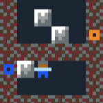
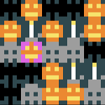

**Inhoud**

- [(terug naar het begin)](index.md)
- [8 - Waarmee wil je verder?](8-waarmee-verder.md)
- [9 - Spelers met karakter](9-spelers-met-karakter.md)
- [10 - Animatie](10-animatie.md)
- [11 - Actie](11-actie.md)
- [12 - Grotere levels en editor](12-grote-levels-editor.md)
- [13 - Op avontuur!](13-op-avontuur.md)
- [14 - Meer voorbeelden](14-meer-voorbeelden.md)

# 14 - Meer informatie

Nog niet uitgepuzzeld? Kijk dan eens naar deze technieken waar we nog niet aan toegekomen zijn. Misschien brengt eentje je op een fantastisch idee!

## Voorbeelden

Elk voorbeeld opent in een nieuw tabblad, dus het overschrijft je eigen spel niet.

### <a target='_blank' href='https://www.puzzlescript.net/editor.html?hack=46dc834b710fca005085e07226b6b938'>Twee karakters die je ombeurten kunt besturen</a>

Druk op X om te wisselen tussen twee spelerkarakters. Zo worden je puzzels extra moeilijk.

### <a target='_blank' href='https://www.puzzlescript.net/editor.html?hack=b8fed376b06397956ec0650c4ad46d28'>Drempel waar speler overheen kan maar kistjes niet</a>

Nog iets om je puzzels ingewikkelder te maken: een speciaal type vloer waar wel spelers maar geen kistjes overheen kunnen.

### <a target='_blank' href='https://www.puzzlescript.net/editor.html?hack=af663364ab76b4c42b857eb5fffca98a'>Portals</a>

Een *portal* verbindt twee plekken in het level. Spelers en kistjes kunnen door de portal van de ene naar de andere plek springen!



### <a target='_blank' href='https://www.puzzlescript.net/editor.html?hack=7835f8c670f5cc26fd0598e980810b44'>3-op-een-rij spelletje</a>

Een bekend soort spelletje waarbij je steeds drie dezelfde symbolen op een rij moet krijgen om ze te laten verdwijnen. Gebruik de pijltjestoetsen om een symbool te kiezen, druk X om het te selecteren, en druk een richting om het symbool te wisselen met z'n buurman. Wisselen mag alleen als het drie (of meer) op een rij oplevert. 



### <a target='_blank' href='https://www.puzzlescript.net/editor.html?hack=b1f354e08755ffd84dbcb9edf251b526'>Schietspel</a>

Een klassiek soort spelletje waarbij je een ruimteschip bestuurt en boosaardige buitenaardse wezens moet schieten. Vijanden komen telkens op willekeurige plaatsen te staan.

## Ingebouwde voorbeeldspellen

Misschien heb je bovenin al "Load example" zien staan. Bij PuzzleScript zitten een aantal voorbeeldspellen waar je van kunt leren. Sla eerst jouw spel op (SAVE) en selecteer dan een van de spellen uit de lijst om de code te bekijken.

(Let op, jouw code wordt overschreven, maar je kunt altijd terug naar de laatst opgeslagen versie door de bovenste optie bij "Load" te kiezen)

## Voor <i>hardcore</i> PuzzleScripters

Hier zijn nog een aantal andere hele knappe PuzzleScript-spellen die niet in de lijst voorbeelden staan:

  - <a href='https://www.puzzlescript.net/play.html?p=6847686' target='_blank'>Pac-Man</a>
  - <a href='https://www.puzzlescript.net/play.html?p=6860122' target='_blank'>Heroes of Sokoban</a>
  - <a href='https://www.puzzlescript.net/play.html?p=6866423' target='_blank'>Dungeon Janitor</a>
  - <a href='https://w.itch.io/herding-cats' target='_blank'>Make friends with every cat</a>
  - <a href='https://rosden.itch.io/islands' target='_blank'>Islands</a>

Een hele verzameling uitdagende puzzelspellen van de maker van PuzzleScript (Stephen Lavelle, bijnaam 'increpare') vind je op <a href='https://www.increpare.com/' target='_blank'>zijn website</a>.

## Extra opties

Misschien had je al gezien dat helemaal bovenaan het programma deze regels staan:

```
title Mijn puzzelspel
author jij
homepage www.puzzlescript.net
```

Dit gedeelte bovenaan wordt de *Prelude* genoemd. Je kunt je spel hier een naam geven en je eigen naam erbij zetten. Maar in dit gedeelte van het programma kun je ook bepaalde extra opties van PuzzleScript opgeven. Dit zijn een paar interessante (sommige hebben we al gezien): 

<dl>

  <dt><code>color_palette <em>nummer</em></code></dt>
  <dd>Gebruik een andere kleurenpalet (alle kleuren zien er iets anders uit). Nummer mag 1-14 zijn.</dd>

  <dt><code>background_color <em>kleur</em></code></dt>
  <dd>Gebruik een andere achtergrondkleur voor titelscherm, berichten, etc.</dd>

  <dt><code>text_color <em>kleur</em></code></dt>
  <dd>Verandert de tekstkleur.</dd>

  <dt><code>scanline</code></dt>
  <dd>Tekent je spel met horizontale strepen, zodat het er (nog meer) uitziet als een heel ouderwets computerspelletje.</dd>
  
  <dt><code>noaction</code></dt>
  <dd>Verbergt de regel "X to action" op het titelscherm. De meeste puzzelspellen hebben behalve de pijltjestoetsen geen aparte actietoets, dus dan is deze instructie niet nodig.</dd>

  <dt><code>youtube wygy721nzRc</code></dt>
  <dd>Laat het geluid van een YouTube-video als achtergrondmuziek horen. Let op, dit werkt alleen als je "SHARE" gebruikt, niet in de PuzzleScript-editor. Je moet de unieke "code" van de youtube-video weten. Dit vind je door naar het adres te kijken, bijvoorbeeld `https://www.youtube.com/watch?v=wygy721nzRc`. Het gedeelte na `v=` is de code die je hier moet gebruiken.</dd>

  <dt><code>debug<br/>verbose_logging</code></dt>
  <dd>Toon hoe PuzzleScript jouw regels heeft uitgeschreven en hoe ze worden toegepast. Interessant als je beter wilt begrijpen hoe PuzzleScript werkt, of een moeilijk probleem probeert op te lossen.</dd>

  <dt><code>flickscreen <i>WxH</i><br/>zoomscreen <i>WxH</i></code></dt>
  <dd>Met deze regels zie je steeds maar een deel van elk level. Met <code>flickscreen 5x5</code> wordt je level in 5x5 vierkantjes opgedeeld, en zie je altijd maar 1 van die vierkantjes. Met <code>zoomscreen 5x5</code> zie ook altijd maar 5x5 vakjes en beweegt de 'camera' mee met de speler.</dd>

  <dt><code>run_rules_on_level_start</code></dt>
  <dd>Soms is het handig als je regels alvast 1x worden toegepast voordat het spel begint. Met deze regel zorg je daar voor.</dd>

  <dt><code>realtime_interval <i>getal</i></code></dt>
  <dd>Hiermee kun je je spel 'realtime' maken. Gebruik bijvoorbeeld <code>realtime_interval 0.1</code> om je regels 10 keer per seconde toe te passen.</dd>

</dl>

## Vragen en antwoorden

<dl>

  <dt>Zijn er uitwerkingen van de vragen in deze CoderDojo?</dt>
  <dd>Ja! Voor uitwerkingen van veel van de vragen in deze CoderDojo: zie <a href='voorbeelden/voorbeeld2.puzzlescript' target='_blank'>voorbeeld van code na stap 5</a> en <a href='voorbeelden/voorbeeld3.puzzlescript' target='_blank'>voorbeeld van code aan het eind</a>. (sla het bestand op en open het in bijv. Kladblok. Gebruik kopieren en plakken om de code in PuzzleScript uit te proberen)</dd>

  <dt>Waar vind ik meer informatie over PuzzleScript?</dt>
  <dd>Klik op DOCS bovenin om de (Engelse) <a href='https://www.puzzlescript.net/Documentation/documentation.html' target='_blank'>documentatie</a> van PuzzleScript te bekijken. Hierin staan nog een aantal mogelijkheden die hier niet genoemd zijn.

  Er zijn ook een aantal stap-voor-stap instructies ("tutorials") voor PuzzleScript. Je vindt ze <a href='https://stuartspixelgames.com/puzzle-script-tutorials/' target='_blank'>hier</a>.</dd>

  <dt>Hoe worden PuzzleScript-regels precies uitgevoerd?</dt>
  <dd>Zie <a href="https://www.puzzlescript.net/Documentation/executionorder.html" target='_blank'>hier</a>. Korte samenvatting: regels worden een voor een zo vaak mogelijk toegepast. Zet <code>debug</code> en <code>verbose_logging</code> bovenin om precies te zien hoe het werkt.</dd>

  <dt>Hoe kun je meerdere kistjes tegelijk schuiven?</dt>
  <dd>Gebruik deze twee regels:<br/><code>
  [ > Speler | Kistje ] -> [ > Speler | > Kistje ]<br/>
  [ > Kistje | Kistje ] -> [ > Kistje | > Kistje ]
  </code></dd>

  <dt>Hoe kun je de actietoets (X) in een spel gebruiken?</dt>
  <dd>Om bijvoorbeeld alle kistjes naast de speler weg te schuiven als je X drukt:<br/>
  <code>[ ACTION Speler | Kistje | no Voorwerp ] -> [ Speler | | Kistje ]</code>
  </dd>

  <dt>Hoe kun je een ander soort vloer maken waar voorwerpen op kunnen staan?</dt>
  <dd>Je kunt een extra <code>COLLISIONLAYER</code> (laag) tussen Achtergrond en Voorwerp maken waar "vloerobjecten" kunnen staan. Objecten op verschillende lagen kunnen op hetzelfde vakje staan, dus een kistje kan bovenop een "vloerobject" staan. Als je een vloerobject <code>Doel</code> maakt en je wilt een regel die zegt dat <code>Kistje</code>s die op het <code>Doel</code> terechtkomen verdwijnen, doe je dat zo:<br/>
  <code>[ Kistje Doel ] -> [ Doel ]</code></dd>

  <dt>Hoe kun je het zo maken dat een geduwd kistje doorbeweegt tot het tegen een muur botst?</dt>
  <dd>Zonder animatie (<code>Kistje</code> springt direct naar eindpunt):<br/>
  <code>
  [ > Speler | Kistje    ] -> [ Speler | > Kistje ]<br/>
  [ > Kistje | no Object ] -> [        | > Kistje ]
  </code><br/>
  Met animatie: zie <a href='10-animatie.html'>het hoofdstuk over animatie</a>.
  </dd>

  <dt>Kan je een 'vijand' maken die naar de speler toe beweegt zodra hij die ziet?</dt>
  <dd><code>[ Speler | ... | no Object | Vijand ] -> [ Speler | ... | Vijand | ]</code></dd>

  <dt>Kan je 4 kistjes laten verdwijnen als ze een vierkant vormen?</dt>
  <dd>Ja, maar dit is wat lastiger, omdat PuzzleScript-regels meestal alleen op 1 rij of kolom werken. Je zou (op een andere laag) een tijdelijk object moeten aanmaken, bijv. <code>TweeKistjesBovenElkaar</code> dat betekent "dit vakje en het vakje eronder bevat een kistje" en dan een regel die checkt op twee <code>TweeKistjesBovenElkaar</code> objecten naast elkaar en er andere tijdelijke objecten van maakt, bijv. <code>VerdwijnendeKistjesBovenElkaar</code>. Als een van de laatste regels zou je alle tijdelijke objecten weer moeten verwijderen.</a></dd>

  <dt>Kan je bijvoorbeeld een verfbom maken die alle voorwerpen om zich heen een bepaalde kleur geeft?</dt>
  <dd>Ja, op een vergelijkbare manier als de vorige vraag. Je zou bijvoorbeeld eerst in de vakjes links en rechts van de bom een tijdelijk object <code>VerfLinksRechts</code> moeten aanmaken en dan met een volgende regel boven en onder die tijdelijke objecten meer tijdelijke objecten moeten aanmaken, bijv. <code>VerfHoek</code>. Daarna kun je regels maken die de tijdelijke objecten gebruikt om voorwerpen te kleuren, en tot slot verwijder je weer alle tijdelijke objecten.</a></dd>

</dl>