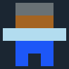

**Inhoud**

- [Inleiding](index.md)
- [1 - Aan de slag met PuzzleScript](1-aan-de-slag-met-puzzlescript.md)
- [2 - Maak je eigen regels](2-maak-je-eigen-regels.md)
- [3 - Kleuren en plaatjes](3-kleuren-en-plaatjes.md)
- [4 - Sla je werk op](4-sla-je-werk-op.md)
- [5 - Nieuwe voorwerpen en winnen](5-nieuwe-voorwerpen-en-winnen.md)
- [6 - Geluid](6-geluid.md)
- [7 - Een woord vormen](7-een-woord-vormen.md)
- [8 - Waarmee wil je verder?](8-waarmee-verder.md)

# 3 - Kleuren en plaatjes

## Kies je kleuren en teken (hele kleine) plaatjes

PuzzleScript ziet er heel eenvoudig uit: elk vakje is maar 5 pixels breed en hoog. Dat is expres, omdat het belangrijker is om snel ideeën uit te proberen dan om het direct mooi te maken. Als je helemaal tevreden bent met je ontwerp, kun je het uitwerken in een andere programmeertaal met mooie graphics, animaties, geluid en muziek.

Natuurlijk is het wel belangrijk dat je in PuzzleScript duidelijk ziet wat wat is, anders wordt het spel spelen erg moeilijk. Daarom kun je simpele plaatjes maken in het `OBJECTS` (voorwerpen) gedeelte.

In dit gedeelte bepaal je welke voorwerpen je spel heeft en hoe ze er uit zien. Hier is bijvoorbeeld de `Speler`:

```
Speler S
(Het figuurtje dat je bestuurt)
darkgray brown lightblue blue
.000.
.111.
22222
.333.
.3.3.
```

In het spel ziet dit er zo uit:



Zoals je ziet staat op de eerste regel de naam van het voorwerp, in dit geval `Speler`, gevolgd door de letter die je hiervoor wilt gebruiken in je levels (`S`). De tweede regel is alleen commentaar en doet verder niets; dit geldt voor alles  in PuzzleScript wat tussen haakjes staat. Op de volgende regel kun je een aantal kleuren zetten met spaties ertussen (de lijst kleuren staat hieronder). Daarna volgen vijf regels met vijf tekens per regel die de pixels van het plaatje vormen. Daarbij is `0` de eerste kleur die je hebt opgegeven, `1` de tweede, enzovoorts. `.` betekent "geen kleur".

(je kunt de laatste 5 regels ook weglaten, zoals bijv. bij `Achtergrond`. Dan krijg je alleen een gekleurd blokje te zien)

Deze kleurnamen kun je gebruiken: `black`, `white`, `lightgray`, `gray`, `darkgray`, `red`, `darkred`, `lightred`, `brown`, `darkbrown`, `lightbrown`, `orange`, `yellow`, `green`, `darkgreen`, `lightgreen`, `blue`, `lightblue`, `darkblue`, `purple`, `pink`, `transparent`. Ook hex-codes (als je die toevallig kent van CSS) werken, zoals `#ffff00`.

Pas de kleuren of de 5x5 pixel plaatjes aan zoals jij wilt!

## Ander verfje

Schilders hebben op hun *palet* alle kleuren van het schilderij waar ze aan bezig zijn. Ook PuzzleScript heeft een soort palet. Door een ander palet te kiezen, zien alle kleuren er iets anders uit, met een iets andere tint groen, iets andere oranje, etc.

Probeer eens een ander palet: zet bovenin je PuzzleScript-code (waar ook `title` staat) eens deze regel:

    color_palette 1

In plaats van 2 kun je ook andere getallen invullen (1 tot en met 14). Welk palet past het best bij jouw spel?

Het titelscherm en andere tekstschermen hebben normaalgesproken witte tekst op een zwarte achtergrond. Maar deze kleuren kun je ook veranderen! Zet deze regels maar eens bovenaan je PuzzleScript-code:

    background_color darkblue
    text_color yellow

## Als je je werk niet kwijt wilt raken, bekijk dan snel [de volgende stap! >>](4-sla-je-werk-op.md)
