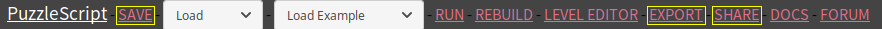

### Inhoud

- [Inleiding](index.md)
- [1 - Aan de slag met PuzzleScript](1-aan-de-slag-met-puzzlescript.md)
- [2 - Maak je eigen regels](2-maak-je-eigen-regels.md)
- [3 - Kleuren en plaatjes](3-kleuren-en-plaatjes.md)
- [4 - Sla je werk op](4-sla-je-werk-op.md)
- [5 - Nieuwe voorwerpen en winnen](5-nieuwe-voorwerpen-en-winnen.md)
- [6 - Geluid](6-geluid.md)
- [7 - Een woord vormen](7-een-woord-vormen.md)
- [8 - Meer voorbeelden](8-meer-voorbeelden.md)
- [9 - Nog niet uitgepuzzeld?](9-er-kan-nog-veel-meer.md)

# 4 - Sla je werk op

Nu je een aantal dingen hebt aangepast, wil je jouw spel natuurlijk niet zomaar kwijtraken. Gelukkig kun je in PuzzleScript je werk op een paar manieren opslaan. Mogelijkheid 1 en 2 zijn het makkelijkst.

## 1 - Lokaal opslaan (SAVE)

Klik op SAVE links bovenaan de pagina om je werk lokaal op te slaan. Dat wil zeggen dat het op deze laptop in deze browser bewaard wordt. Het is verstandig om dit regelmatig te doen, zodat je geen werk kwijtraakt als bijvoorbeeld de batterij van de laptop leeg is.

Als je met je eigen laptop werkt, is SAVE de simpelste manier om je werk op te slaan zodat je later verder kunt. Werk je op een leenlaptop, dan zul je het op een andere manier moeten opslaan als je er later verder mee wilt.

**LET OP:** als je de pagina herlaadt, ga je weer terug naar het beginproject. Maar door op "Load" bovenaan te klikken, zie je een lijst met alle versies die je opgeslagen hebt met de datum en tijd erbij. Selecteer de bovenste om je laatst opgeslagen versie terug te krijgen.

## 2 - De code naar jezelf mailen of opslaan in een bestand

Je kunt het hele PuzzleScript-programma natuurlijk naar jezelf mailen, of het opslaan in een bestand op een USB-stickje.

Om het PuzzleScript-programma naar het klembord te kopi&euml;ren: klik op het programma en druk Ctrl+A (alles selecteren). Als het hele programma geselecteerd is, druk je op Ctrl+C (kopi&euml;ren). Daarna kun je het plakken (met Ctrl+V) in een mailtje of een leeg tekstbestand (in het programma Kladblok). (Als je op een Apple-laptop werkt, gebruik je Command+A, Command+C en Command+V)

Als je volgende keer weer verder wilt, doe je het omgekeerde: je opent je mailtje of bestand met de code, selecteert alles, gaat naar PuzzleScript, verwijdert daar alle code, en plakt jouw eigen code.

Er zijn nog twee opslagmogelijkheden: SHARE en EXPORT. Die heb je misschien niet meteen nodig, maar we noemen ze toch even.

## 3 - Delen (SHARE)

Het is met PuzzleScript mogelijk om je puzzelspel op te slaan en te delen met anderen via GitHub. Je hebt hiervoor wel een (gratis) GitHub-account nodig (dat kun je <a href='https://github.com/join' target='_blank'>hier</a> aanvragen).

Klik op SHARE bovenin. PuzzleScript zegt dat je toestemming moet geven voor het delen. Klik op de link die rechtsonderin verschijnt en geef toestemming. Klik dan opnieuw op SHARE en PuzzleScript toont rechtsonderin twee links: een link naar de source code, voor als je er zelf verder mee wilt werken, en een link waar mensen je spel op volledig scherm kunnen spelen.

Let op: als je nog wijzigingen maakt aan een spel dat je hebt geSHAREd, moet je het opnieuw SHAREn om deze wijzigingen ook op te slaan. Je krijgt weer twee nieuwe links naar de laatste versie van je spel.

## 4 - Exporteren (EXPORT)

Het is ook mogelijk om je spel op te slaan zodat je het kunt spelen zonder met internet verbonden te zijn. Druk hiervoor op EXPORT. Je downloadt een HTML-bestand waar het hele spel in zit. Dit bestand kun je alleen niet makkelijk meer wijzigen, dus als je nog verder wilt werken aan het spel, kun je beter een van de bovenstaande manieren gebruiken.

## Kun je ook nieuwe voorwerpen toevoegen aan het spel? Jazeker! Kijk maar bij [de volgende stap! >>](5-nieuwe-voorwerpen-en-winnen.md)