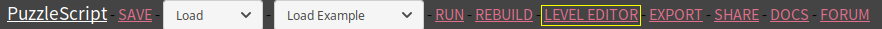
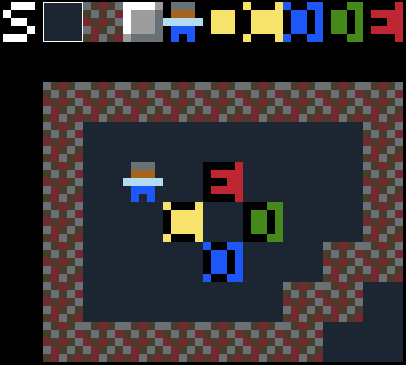

### Inhoud

- [1 - Aan de slag met PuzzleScript](1-aan-de-slag-met-puzzlescript.md)
- [2 - Maak je eigen regels](2-maak-je-eigen-regels.md)
- [3 - Kleuren en plaatjes](3-kleuren-en-plaatjes.md)
- [4 - Sla je werk op](4-sla-je-werk-op.md)
- [5 - Nieuwe voorwerpen en winnen](5-nieuwe-voorwerpen-en-winnen.md)
- [6 - Geluid](6-geluid.md)
- [7 - Een woord vormen](7-een-woord-vormen.md)
- [8 - Er kan nog veel meer](8-er-kan-nog-veel-meer.md)

# 8 - Er kan nog veel meer

## Leveleditor



Er zit ook een leveleditor ingebouwd in PuzzleScript. Klik op LEVEL EDITOR bovenin om hem te activeren. Je kunt je level dan in het spel bewerken.



Bovenaan staan alle voorwerpen in het spel. Klik op een voorwerp en dan in het level om dat voorwerp te plaatsen. Rechtsklik om een voorwerp weer te verwijderen.

LET OP: als je tevreden bent over je level, moet je nog wel op het S-knopje klikken, links boven je level. Onder je level verschijnt dan de code voor het level. Deze moet je zelf kopi&euml;ren en plakken in het `LEVELS` gedeelte van de code, anders worden je wijzigingen niet opgeslagen!

## Extra opties

Misschien had je al gezien dat helemaal bovenaan het programma deze regels staan:

```
title Mijn puzzelspel
author jij
homepage www.puzzlescript.net
```

Je kunt je spel hier een naam geven en je eigen naam erbij zetten. Maar in dit gedeelte van het programma kun je ook bepaalde extra opties van PuzzleScript opgeven. Hier zijn een paar interessante:

<dl>

  <dt><code>color_palette <em>nummer</em></code></dt>
  <dd>Gebruik een andere kleurenpalet (alle kleuren zien er iets anders uit). Nummer mag 1-14 zijn.</dd>

  <dt><code>background_color <em>kleur</em></code></dt>
  <dd>Gebruk een andere achtergrondkleur voor titelscherm, berichten, etc.</dd>

  <dt><code>text_color <em>kleur</em></code></dt>
  <dd>Verandert de tekstkleur.</dd>

  <dt><code>scanline</code></dt>
  <dd>Tekent je spel met horizontale strepen, zodat het er (nog meer) uitziet als een heel ouderwets computerspelletje.</dd>
  
  <dt><code>noaction</code></dt>
  <dd>Verbergt de regel "X to action" op het titelscherm. De meeste puzzelspellen hebben behalve de pijltjestoetsen geen aparte actietoets,
  dus dan is deze instructie niet nodig.</dd>

  <dt><code>youtube wygy721nzRc</code></dt>
  <dd>Laat het geluid van een YouTube-video als achtergrondmuziek horen. Let op, dit werkt alleen als je "SHARE" gebruikt, niet in de PuzzleScript-editor. Je moet de unieke "code" van de youtube-video weten. Dit vind je door naar het adres te kijken, bijvoorbeeld `https://www.youtube.com/watch?v=wygy721nzRc`. Het gedeelte na `v=` is de code die je hier moet gebruiken.</dd>

  <dt><code>debug<br/>verbose_logging</code></dt>
  <dd>Toon hoe PuzzleScript jouw regels heeft uitgeschreven en hoe ze worden toegepast. Interessant als je beter wilt begrijpen hoe PuzzleScript werkt, of een moeilijk probleem probeert op te lossen.</dd>

</dl>

## Voorbeeldspellen

Misschien heb je bovenin al "Load example" zien staan. Bij PuzzleScript zitten een aantal voorbeeldspellen waar je van kunt leren. Sla eerst jouw spel op (SAVE) en selecteer dan een van de spellen uit de lijst om de code te bekijken.

(Let op, jouw code wordt overschreven, maar je kunt altijd terug naar de laatst opgeslagen versie door de bovenste optie bij "Load" te kiezen)

Hier zijn nog een aantal andere hele knappe PuzzleScript-spellen die niet in de lijst voorbeelden staan:

  - <a href='https://www.puzzlescript.net/play.html?p=6847686' target='_blank'>Pac-Man</a>
  - <a href='https://www.puzzlescript.net/play.html?p=6860122' target='_blank'>Heroes of Sokoban</a>
  - <a href='https://www.puzzlescript.net/play.html?p=6866423' target='_blank'>Dungeon Janitor</a>
  - <a href='https://w.itch.io/herding-cats' target='_blank'>Make friends with every cat</a>
  - <a href='https://rosden.itch.io/islands' target='_blank'>Islands</a>

Een hele verzameling uitdagende puzzelspellen van de maker van PuzzleScript (Stephen Lavelle, bijnaam 'increpare') vind je op <a href='https://www.increpare.com/' target='_blank'>zijn website</a>.


## Meer informatie

Klik op DOCS bovenin om de (Engelse) <a href='https://www.puzzlescript.net/Documentation/documentation.html' target='_blank'>documentatie</a> van PuzzleScript te bekijken. Hierin staan nog een hoop mogelijkheden die hier niet genoemd zijn.

Er zijn ook een aantal stap-voor-stap instructies ("tutorials") voor PuzzleScript. Je vindt ze <a href='https://stuartspixelgames.com/puzzle-script-tutorials/' target='_blank'>hier</a>.


## Vragen en antwoorden

<dl>

  <dt>Hoe worden PuzzleScript-regels precies uitgevoerd?</dt>
  <dd>Zie <a href="https://www.puzzlescript.net/Documentation/executionorder.html" target='_blank'>hier</a>. Korte samenvatting: regels worden een voor een zo vaak mogelijk toegepast. Zet <code>debug</code> en <code>verbose_logging</code> bovenin om precies te zien hoe het werkt.</dd>

  <dt>Hoe kun je meerdere kistjes tegelijk schuiven?</dt>
  <dd>Gebruik deze twee regels:<br/><code>
  [ > Speler | Kistje ] -> [ > Speler | > Kistje ]<br/>
  [ > Kistje | Kistje ] -> [ > Kistje | > Kistje ]
  </code></dd>

  <dt>Hoe kun je de actietoets (X) in een spel gebruiken?</dt>
  <dd>Om bijvoorbeeld alle kistjes naast de speler weg te schuiven als je X drukt:<br/>
  <code>[ ACTION Speler | Kistje | no Voorwerp ] -> [ Speler | | Kistje ]</code>
  </dd>

  <dt>Hoe kun je een ander soort vloer maken waar voorwerpen op kunnen staan?</dt>
  <dd>Je kunt een extra `COLLISIONLAYER` (laag) tussen Achtergrond en Voorwerp maken waar "vloerobjecten" kunnen staan. Objecten op verschillende lagen kunnen op hetzelfde vakje staan, dus een kistje kan bovenop een "vloerobject" staan. Als je een vloerobject `Doel` maakt en je wilt een regel die zegt dat `Kistje`s die op het `Doel` terechtkomen verdwijnen, doe je dat zo:<br/>
  <code>[ Kistje Doel ] -> [ Doel ]</code></dd>

  <dt>Kun je knoppen maken die deuren openen?</dt>
  <dd>Ja, zie bijvoorbeeld <a href="https://www.puzzlescript.net/editor.html?hack=6860122" target='_blank'>Heroes of Sokoban</a>.</dd>

  <dt>Hoe kun je het zo maken dat een geduwd kistje doorbeweegt tot het tegen een muur botst?</dt>
  <dd>Zonder animatie (`Kistje` springt direct naar eindpunt):<br/>
  <code>
  [ > Speler | Kistje    ] -> [ Speler | > Kistje ]<br/>
  [ > Kistje | no Object ] -> [        | > Kistje ]
  </code><br/>
  Met animatie: zie volgende vraag.
  </dd>

  <dt>Kun je animatie gebruiken?</dt>
  <dd>Ja, zie <a href="https://stuartspixelgames.com/2017/04/06/how-to-do-animation-in-puzzlescript/" target='_blank'>hier.</a></dd>

  <dt>Kun je real-time spelletjes maken in plaats van turn-based?</dt>
  <dd>Ja, zie <a href="https://www.puzzlescript.net/Documentation/realtime.html" target='_blank'>hier</a>.</dd>

  <dt>Kan je een 'vijand' maken die naar de speler toe beweegt zodra hij die ziet?</dt>
  <dd><code>[ Speler | ... | no Object | Vijand ] -> [ Speler | ... | Vijand | ]</code></dd>

  <dt>Kan je een knop maken die deuren opent als de speler of een kistje er op staat?</dt>
  <dd>Ja, zie <a href="https://stuartspixelgames.com/2016/06/05/checking-multiple-conditions-in-puzzle-script/" target='_blank'>hier.</a></dd>

  <dt>Kan je 4 kistjes laten verdwijnen als ze een vierkant vormen?</dt>
  <dd>Ja, maar dit is wat lastiger, omdat PuzzleScript-regels alleen op 1 rij of kolom werken. Je zou (op een andere laag) een tijdelijk object moeten aanmaken, bijv. <code>TweeKistjesBovenElkaar</code> dat betekent "dit vakje en het vakje eronder bevat een kistje" en dan een regel die checkt op twee <code>TweeKistjesBovenElkaar</code> objecten naast elkaar en er andere tijdelijke objecten van maakt, bijv. <code>VerdwijnendeKistjesBovenElkaar</code>. Als een van de laatste regels zou je alle tijdelijke objecten weer moeten verwijderen.</a></dd>

  <dt>Kan je bijvoorbeeld een verfbom maken die alle voorwerpen om zich heen een bepaalde kleur geeft?</dt>
  <dd>Ja, op een vergelijkbare manier als de vorige vraag. Je zou bijvoorbeeld eerst in de vakjes links en rechts van de bom een tijdelijk object <code>VerfLinksRechts</code> moeten aanmaken en dan met een volgende regel boven en onder die tijdelijke objecten meer tijdelijke objecten moeten aanmaken, bijv. <code>VerfHoek</code>. Daarna kun je regels maken die de tijdelijke objecten gebruikt om voorwerpen te kleuren, en tot slot verwijder je weer alle tijdelijke objecten.</a></dd>

</dl>


