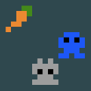
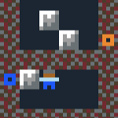
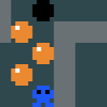
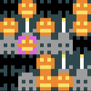

**Inhoud**

- [Inleiding](index.md)
- [1 - Aan de slag met PuzzleScript](1-aan-de-slag-met-puzzlescript.md)
- [2 - Maak je eigen regels](2-maak-je-eigen-regels.md)
- [3 - Kleuren en plaatjes](3-kleuren-en-plaatjes.md)
- [4 - Sla je werk op](4-sla-je-werk-op.md)
- [5 - Nieuwe voorwerpen en winnen](5-nieuwe-voorwerpen-en-winnen.md)
- [6 - Geluid](6-geluid.md)
- [7 - Een woord vormen](7-een-woord-vormen.md)
- [8 - Meer voorbeelden](8-meer-voorbeelden.md)
- [9 - Nog niet uitgepuzzeld?](9-er-kan-nog-veel-meer.md)

# 8 - Meer voorbeelden

Hier zijn nog een aantal voorbeelden van wat je kunt doen met PuzzleScript. Elk voorbeeld opent in een nieuw tabblad, dus het overschrijft je eigen spel niet.

## Graphics

- <a target='_blank' href='https://www.puzzlescript.net/editor.html?hack=7fb5dfd7af4edcbd77a1fdf781e09630'>Iets groter figuurtje</a>
- <a target='_blank' href='https://www.puzzlescript.net/editor.html?hack=30ad34a24a668d728699d631ba7cad87'>Figuurtje verandert van richting</a>

## Meerdere figuurtjes

- <a target='_blank' href='https://www.puzzlescript.net/editor.html?hack=4c7c6ed93d844f701f8eecc462d5c189'>Gesprekje voeren</a>
- <a target='_blank' href='https://www.puzzlescript.net/editor.html?hack=46dc834b710fca005085e07226b6b938'>Twee karakters die je ombeurten kunt besturen</a>

## Dingen doen

- <a target='_blank' href='https://www.puzzlescript.net/editor.html?hack=b8fed376b06397956ec0650c4ad46d28'>Drempel waar speler overheen kan maar kistjes niet</a>
- <a target='_blank' href='https://www.puzzlescript.net/editor.html?hack=fb56063e895cda09490f0a2fd24f3724'>Voorwerpen oppakken</a>
- <a target='_blank' href='https://www.puzzlescript.net/editor.html?hack=1921649f0225820ff3dd08a1da3111a1'>Spook-speler die door muren kan lopen</a>
- <a target='_blank' href='https://www.puzzlescript.net/editor.html?hack=d745b4dd69fc65d639036b265c50a90e'>Knop en deur</a>
- <a target='_blank' href='https://www.puzzlescript.net/editor.html?hack=af663364ab76b4c42b857eb5fffca98a'>Portals</a>

## "Realtime" spellen

- <a target='_blank' href='https://www.puzzlescript.net/editor.html?hack=2629d8f2cb707fa72f5ede9f9d7b420b'>Animatie (pompoenen rollen)</a>
- <a target='_blank' href='https://www.puzzlescript.net/editor.html?hack=89bc7e7e1785814d2605c210ef86c8bf'>Zelf bewegend figuurtje</a> (vleermuis en vliegen)

## Andere soorten spellen

- <a target='_blank' href='https://www.puzzlescript.net/editor.html?hack=7835f8c670f5cc26fd0598e980810b44'>3-op-een-rij spelletje</a>
- <a target='_blank' href='https://www.puzzlescript.net/editor.html?hack=637f03e3c4899dec47f2d98b868a80db'>Zoek de schat (meerdere schermen)</a>

## Ingebouwde voorbeeldspellen

Misschien heb je bovenin al "Load example" zien staan. Bij PuzzleScript zitten een aantal voorbeeldspellen waar je van kunt leren. Sla eerst jouw spel op (SAVE) en selecteer dan een van de spellen uit de lijst om de code te bekijken.

(Let op, jouw code wordt overschreven, maar je kunt altijd terug naar de laatst opgeslagen versie door de bovenste optie bij "Load" te kiezen)

## Voor <i>hardcore</i> PuzzleScripters

Hier zijn nog een aantal andere hele knappe PuzzleScript-spellen die niet in de lijst voorbeelden staan:

  - <a href='https://www.puzzlescript.net/play.html?p=6847686' target='_blank'>Pac-Man</a>
  - <a href='https://www.puzzlescript.net/play.html?p=6860122' target='_blank'>Heroes of Sokoban</a>
  - <a href='https://www.puzzlescript.net/play.html?p=6866423' target='_blank'>Dungeon Janitor</a>
  - <a href='https://w.itch.io/herding-cats' target='_blank'>Make friends with every cat</a>
  - <a href='https://rosden.itch.io/islands' target='_blank'>Islands</a>

Een hele verzameling uitdagende puzzelspellen van de maker van PuzzleScript (Stephen Lavelle, bijnaam 'increpare') vind je op <a href='https://www.increpare.com/' target='_blank'>zijn website</a>.
