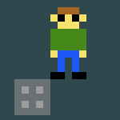

**Inhoud**

- [Inleiding](index.md)
- [1 - Aan de slag met PuzzleScript](1-aan-de-slag-met-puzzlescript.md)
- [2 - Maak je eigen regels](2-maak-je-eigen-regels.md)
- [3 - Kleuren en plaatjes](3-kleuren-en-plaatjes.md)
- [4 - Sla je werk op](4-sla-je-werk-op.md)
- [5 - Nieuwe voorwerpen en winnen](5-nieuwe-voorwerpen-en-winnen.md)
- [6 - Geluid en muziek](6-geluid.md)
- [7 - Een woord vormen](7-een-woord-vormen.md)
- [8 - Waarmee wil je verder?](8-waarmee-verder.md)

# 8 - Waarmee wil je verder?

Je hebt nu de basis van PuzzleScript onder de knie, maar er kan nog veel meer!

Kies hieronder een onderwerp wat je leuk lijkt en klik op het kopje!

## [9 - Spelers met karakter](9-spelers-met-karakter.md)

PuzzleScript heeft maar heel simpele plaatjes. Toch is het leuk als je je spelerfiguur wat meer een eigen karakter kunt geven.

Hier leer je hoe je de speler (ietsje) groter kunt maken, en hoe je verschillende plaatjes kunt tonen afhankelijk van welke richting de speler op kijkt.

## [10 - Animatie](10-animatie.md)

Een beetje meer beweging brengt leven in de brouwerij! Als voorbeeld maken we een flakkerend vlammetje.

## [11 - Actie!](11-actie.md)

Een PuzzleScript-level verandert meestal alleen wanneer de speler een stap zet. Maar wat als je andere dingen wilt laten gebeuren? Bijvoorbeeld: een bal die doorrolt wanneer je 'm duwt, of door de computer bestuurde karakters.

## [12 - Grotere levels en de leveleditor](12-grote-levels-editor.md)

Kleine levels zijn leuk, maar misschien wil je meer een avonturenspel maken, waarin je rondloopt in een grotere wereld. Dat kan ook!

## [13 - Op avontuur!](13-op-avontuur.md)

Een grote wereld wil je natuurlijk vullen met interessante mogelijkheden. We kijken naar het voeren van gesprekjes, het gebruiken van voorwerpen, knoppen en (geheime) deuren en magische drankjes.

## [14 - Meer voorbeelden](14-meer-voorbeelden.md)

Er is nog meer mogelijk in PuzzleScript! Hier vind je nog een aantal leuke voorbeeldjes en andere mogelijkheden waar je zelf mee aan de slag kunt gaan.

<!---

## [14 - Moeilijk: explosies](14-explosies.md)

Het is in PuzzleScript niet zo makkelijk om regels te maken die effect hebben op alle vakjes rondom een element, maar het kan wel.

## [15 - Moeilijk: grotere elementen](15-grotere-elementen.md)

Een schuifpuzzel maken met grote elementen die uit een aantal vakjes bestaan? Dat is niet zo eenvoudig, maar met deze trucs lukt het.

## [16 - Moeilijk: interdimensionele poorten](15-portals.md)

Misschien ken je het spel Portal, waarbij je twee "poorten" kunt maken die direct met elkaar in verbinding staan. Kan dit in PuzzleScript? Het is lastig, maar we kunnen een heel eind komen!

## [17 - Nog meer!?](17-nog-meer.md)

Nog een aantal voorbeeldjes en links naar andere interessante PuzzleScript pagina's.

Schietspel:

https://www.puzzlescript.net/editor.html?hack=b1f354e08755ffd84dbcb9edf251b526

-->