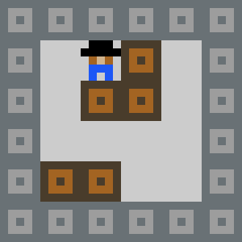
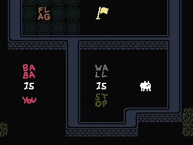
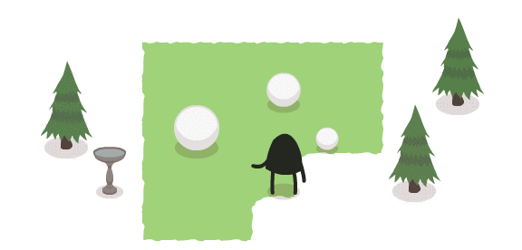
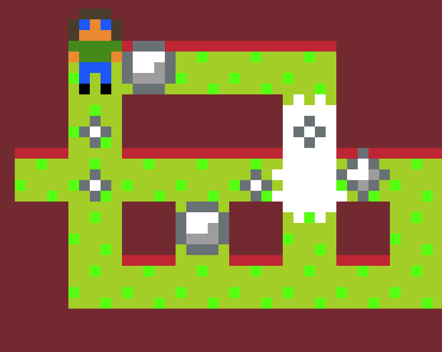

**Inhoud**

- [Inleiding](index.md)
- [1 - Aan de slag met PuzzleScript](1-aan-de-slag-met-puzzlescript.md)
- [2 - Maak je eigen regels](2-maak-je-eigen-regels.md)
- [3 - Kleuren en plaatjes](3-kleuren-en-plaatjes.md)
- [4 - Sla je werk op](4-sla-je-werk-op.md)
- [5 - Nieuwe voorwerpen en winnen](5-nieuwe-voorwerpen-en-winnen.md)
- [6 - Geluid en muziek](6-geluid.md)
- [7 - Een woord vormen](7-een-woord-vormen.md)
- [8 - Waarmee wil je verder?](8-waarmee-verder.md)

# Een spel gemaakt met PuzzleScript

Zo ziet een spel dat met PuzzleScript gemaakt is er bijvoorbeeld uit:

# Voorbeelden van puzzelspellen

Hier zijn nog een aantal voorbeeldjes van logische puzzelspellen. Misschien krijg je er een goed idee van.

## Soko Ban

Een van de eerste puzzelspellen. Je moet kistjes duwen en op de juiste plekken neerzetten.

## Stephen’s Sausage Roll
Je moet worstjes over grillplaten rollen om ze te bakken, maar ze niet laten verbranden.

## Baba is You
Je kunt als speler de regels van het spel veranderen zodat je bijvoorbeeld door muren heen kunt lopen.

## A good snowman is hard to build
Je kunt sneeuwballen van verschillende grootte rollen en opstapelen om sneeuwmannen te maken.

Ken je nog meer van dit soort spellen?

# Wat hebben deze spellen met elkaar gemeen?

Bijvoorbeeld:

<ul>
<li>Je moet logisch nadenken om een puzzel op te lossen</li>
<li>Het speelveld bestaat uit vakjes</li>
<li>Er zijn muren en voorwerpen die kunnen bewegen, zoals kistjes, sneeuwballen of worstjes</li>
<li>Je bestuurt meestal 1 figuurtje</li>
<li>Je ziet het meestal van bovenaf (maar opzij kan ook)</li>
<li>De graphics zijn meestal vrij eenvoudig; daar draait het niet om</li>
<li>...</li>
</ul>

# Hoe ontwerp je zo’n spel?

PuzzleScript is gemaakt om snel ideeën te kunnen uitproberen, zonder veel tijd te besteden aan hoe het er uitziet.

De maker van "A good snowman is hard to build" heeft z'n spel ook eerst ontworpen in PuzzleScript.

Toen hij zag dat het leuk was om te spelen, heeft hij pas de mooie versie die je hierboven zag gemaakt. Zo zie je dat eenvoudig beginnen goed werkt!

## Ga nu zelf [aan de slag met PuzzleScript](1-aan-de-slag-met-puzzlescript.md). Succes!
